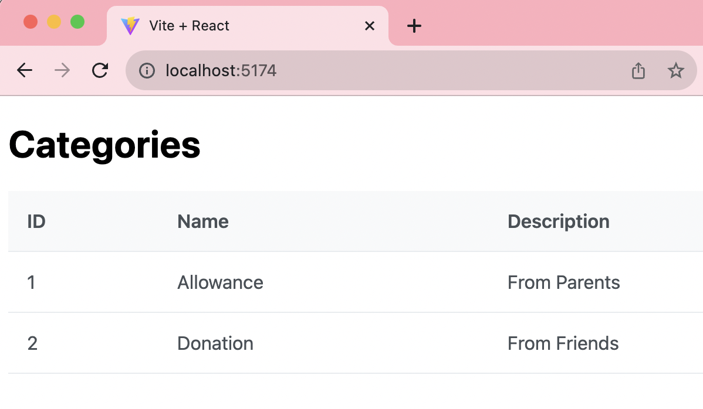
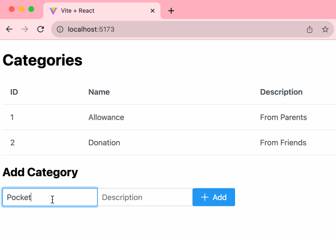

# Financial Tracker using React JS

```bash
# git clone https://github.com/cbatuic/react-fintrack-1.git
# cd react-fintrack-1
# npm install
# npm run dev
```

### Code Structure
```bash
+ react-fintrack-1
|___+ node_modules
    |___ ...
|___+ public
    |___ vite.svg
|___+ src
    |___+ assets
    |___ App.css
    |___ App.jsx
    |___ index.css
    |___ main.jsx
|___ index.html
|___ README.md
|___ vite.config.js
|___ package.json
|___ package-lock.json
|___ .gitignore
```
* ```react-fintrack-1``` (Directory): The root directory of the React project.
    1. ```node_modules``` (Directory): This directory contains the dependencies installed for the project. It's managed by npm or Yarn and typically not added to version control.
    2. ```public``` (Directory): This directory may contain publicly accessible files, like static assets or the index.html file.
        * ```vite.svg```: A static asset (SVG file) that may be used in the application.
    3. ```src``` (Directory): The directory where the application's source code is located.
        * ```assets``` (Directory): This directory might contain additional assets used in the project.
        * ```App.css```: A CSS file related to the React component(s), likely used for styling App component.
        * ```App.jsx```: A JavaScript/React component file that may represent the main application or a key part of the app. In this starter code this file contains the Category component that allows user to add new item.
        * ```index.css```: Another CSS file, possibly for global styles or custom styling related to the entry point of the application.
        * ```main.jsx```: A JavaScript file that serves as the entry point of the React application or where the main logic is implemented.
    4. ```index.html```: The main HTML file for the application, which is typically the starting point for rendering React components.
    5. ```README.md```: A markdown file that usually contains documentation or instructions for the project.
    6. ```vite.config.js```: A configuration file for Vite, the build tool or bundler for the project.
    7. ```package.json```: A JSON file that defines the project's metadata and dependencies, often used for package management with npm or Yarn.
    8. ```package-lock.json```: A lockfile that records the exact versions of all the dependencies installed in the project to ensure consistent builds.
    9. ```.gitignore```: A file that specifies patterns of files and directories to be ignored by Git, typically used to exclude generated or temporary files.

This project structure is for the ```React JS``` application built with ```Vite```, a build tool and development server for modern web development. The specific purpose and content of these files may vary depending on the project's requirements and setup.

### Code Snippets

```js
import { DataTable } from 'primereact/datatable';
import { Column } from 'primereact/column';
```
> The code sets up the necessary imports for using ```PrimeReact``` components in a React component. It builds a web application with a data table, and columns using the PrimeReact library in a React application. 

```js
function App(){
    //App component's behavior/logic here...
    return(
        //App component's structure/user-interface here...
    );
}
export default App;
```
> This code snippet defines a ```React``` [***functional component***](https://react.dev/learn/keeping-components-pure#purity-components-as-formulas) named ```App```, which typically houses the core ***logic*** and ***user*** interface structure of a React application. The comment placeholders indicate where developers should add application-specific logic and the user interface structure using [***JSX***](https://react.dev/learn/writing-markup-with-jsx). 

> The final line ```exports App``` as the default export, enabling it to be imported and used with a chosen variable name in other parts of the application. This snippet represents the foundational structure of a React application, separating logic and presentation within the same component.

```js
  const categories = [
    {
      id: 1,
      name: "Allowance",
      description: "From Parents"
    },
    {
      id: 2,
      name: "Donation",
      description: "From Friends"
    },
```
> The provided code initializes categories which holds the category data. 

```js
<DataTable value={categories}>
    <Column field="id" header="ID"></Column>
    <Column field="name" header="Name"></Column>
    <Column field="description" header="Description"></Column>
</DataTable>
```
> This code represents the rendering of a data table using [***PrimeReact components***](https://primereact.org/datatable/) within a React application. The `DataTable` component is used to display tabular data, and it is populated with data from the `categories` state. Inside the `DataTable`, three `Column` components define the columns of the table: "ID," "Name," and "Description." 

> These columns are configured to display data from the `categories` array based on the corresponding `field` properties, which specify which object property to show in each column. This code is responsible for rendering a table that displays the categories' ID, name, and description in the user interface of the application.

### Preview



### Extra Challenge
1. Create an **Add** functional component.

    ```js
    const handleAdd = () => {
        // edit logic here...
    };
    ```

2. Update the ```DataTable``` once the changes are saved.

